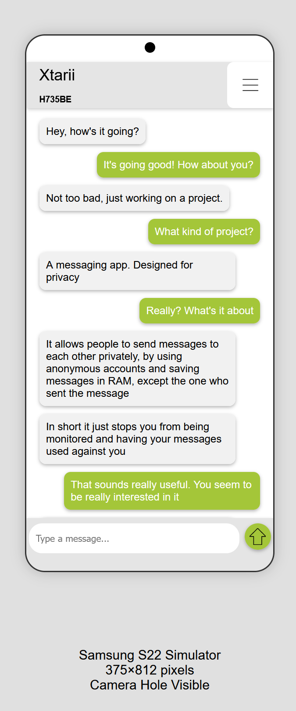

# Fadesol, Private Message Application


### Server Communication Data - [ SocketDataTypes ]

The Following is a list of the data types that the server communicates with,
and what each communication object takes for parameters.


The following is for when a client sends a message to the **server**
| Type          | Index | Parameters                                            |
| ------------- | ----- | ----------------------------------------------------- |
| UUID          | 0     | {}                                                    |
| NAME          | 1     | { name: string }                                      |
| CONNECT       | 2     | { name: string, uuid: string }                        |
| ---           | ---   | ---                                                   |
| MESSAGE       | 3     | { receiver: string, message: string }                 |
| ---           | ---   | ---                                                   |
| ERROR         | -1    | **Not Yet Implemented**                               |


The following is for when the server sends a message to a **client**
| Type          | Index | Parameters                                            |
| ------------- | ----- | ----------------------------------------------------- |
| UUID          | 0     | { uuid: string }                                      |
| NAME          | 1     | { name: string, uuid: string }                        |
| CONNECT       | 2     | **Not Yet Implemented**                               |
| ---           | ---   | ---                                                   |
| MESSAGE       | 3     | { sender: string, uuid: string, message: string }     |
| ---           | ---   | ---                                                   |
| ERROR         | -1    | { cause: string }                                     |


##### Examples of communication

Client to Server - Message Example
```ts
{
    receiver: "<client uuid>",
    message: "Hello World!"
}
```

Server to Client - Message Example
```ts
{
    sender: "<name>", // Both sender and UUID will have a value to identify the sender
    uuid: "<sender uuid>",

    message: "Hello World!"
}
```


In order to send a message to the server an ```auth string``` is required and a ```data type```,
an example of a full message sent to the server.
```ts
{
    type: <data type index>,
    auth: "<auth string>",

    // This is an example of what data could look like
    data: {

        receiver: "<uuid>",
        message: "Hello World!"

    },
}
```


### Connect to the server

There are some steps to connect to the server, and to send messages to the server.
```md
- Get public certificate from server - HTTP, Port 19925
- Create a SSL secured Socket - TCP, Port 19918

- If the client does not have a UUID, send a UUID request to the server **( See the tables above )**
- Send a connection message to the server **( See the tables above )**

- Now you are able to send messages to the server
```

Each message, event the HTTP request needs an ```auth``` parameter.
Example of getting the certificate from the server would be to send the following HTTP
```bash
http://<IP>/?auth=<AUTH>
```

And to send a message to the server use the same auth for all the messages.
```ts
{
    type: <data type index>,
    auth: <AUTH>,

    data: { ... }
}
```


<br><br><br><br><br><br><br><br><br><br>

# Private_Messenger
RAM-based messaging app

Project concept:
A messaging app where one can generate an account, like mullvad VPN does and immedietly get access to the messaging service. It will generate a random account login and ID, and then you get to choose a nickname/name for the user.




## Project description
### Example:
You create an account by pressing a "start account", which generates an account login for you to keep for yourself. An ID for the account which you can share to anyone to find other people, like a street address so to message one you add their ID to your contacts. And lastly a nickname so people know who they're messaging, example gadan with an ID of "AC312K" or Xtarii with an ID of "BK523A". This data will be stored in an XML file locally on the users device, nowhere else. So if the user loses their device or deletes the app/XML file it permanently removes everything of the user and all connections and messages to it.

### Server:
There will be a "middle man" server where you send your message encrypted to with a request of which ID you wanna send the message to. It works by sending your message to the servers RAM, then the server will look for the ID it was requested to send to and send the message to that device. If that device with the ID you requested to send to is not available it will store your message in the servers RAM for 1 week / 7 days and ping every 1 minute the first day, and every 5 minutes the following days to look for the ID to go online again. If it finds the ID it will send the message to that device. But if the 7 days has passed it will delete the message from the servers RAM and send an error message back to the original sender to notify the message has not been sent.

### The app:
The app will constantly be running in the operating systems background when you start up the device. So as long as your device is powered on you can recieve notifications when a user sends you a message and read them when you open the app, because it sends the message from the server to your device. When you turn off the device it will clear the RAM deleting all messages recieved, but still keep the ones sent as they're stored locally on your device.

This makes it possible in the future of a later version for a user to read the history of a conversation by requesting a peer-to-peer connection to get the messages from both sides. So that user 1 who has their own messages stored on their device can share their messages to fullfil the history of user 2's stored messages so they can look back in time for important messages they may have forgotten. Of course all messages recieved by user 1 through peer-to-peer will be stored in user 2's RAM. So when user 2 closes the app it deletes the history recieved from user 1's messages and you would need to request it again to see the complete history.

Summarized, your local device ONLY stores information on your account ID, nickname and messages you have sent, not recieved. Meaning if a user deletes the app it will permanently delete all messages said by the user and all connections to the user as the ID is gone.


### Adding Users ( QR Code )
The QR Code for adding users should include 3 values - this is important on all applications.
The QR Code should include:
- name
- uuid
- provider

This is so the application knows that the QR Code is valid,

- name: the users name
- uuid: the users uuid
- prodiver: the provider name


Example of QR Code URL in Kotlin
```kt
private fun constructQRCodeLink(context: Context) : String {
    val route = "/add"
    val provider = context.getString(R.string.app_name)
    return "app://private.message.app?route=$route&name=$name&uuid=$uuid&provider=$provider"
}
```
In the above example the route is **non important** as it is just for the application route system.
The first section is for android to know what application to open the QR code in, this is **not important**
and just used when the QR Code is scanned outside the application in the camera **[ May be removed ]**
The important data is **provider, name and uuid** which is variables in this code.

The order in which these come is unimportant, it is just important that these are inqluded and
consistent over all applications.
